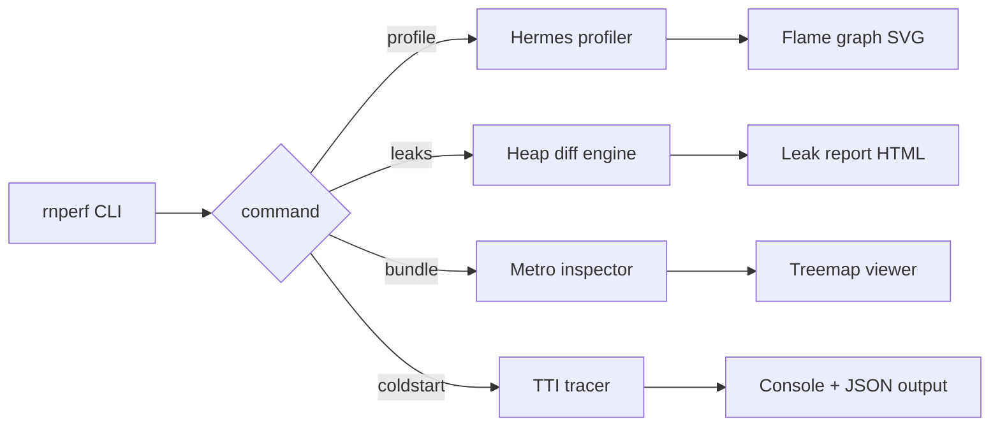

<div align="center">

# ⚡ rn-perf-toolkit

**Production-grade performance toolkit for React Native — profiler, leak detector, bundle analyzer**

_The toolkit I wished existed when I was migrating a HealthTech app to RN 0.72 and cut cold-start by 25%._

[](https://reactnative.dev)
[](https://www.typescriptlang.org)
[](#)
[](LICENSE)

</div>

---

## 🎯 What's in the box

A single CLI that bundles three things every RN dev needs but nobody packages together:

| Command | What it does |
|---|---|
| `rnperf profile` | Records JS thread, native thread, and frame drops during a session — outputs a flame graph |
| `rnperf leaks` | Snapshots heap, replays a flow N times, diffs retained objects — surfaces real leaks, not `console.warn` noise |
| `rnperf bundle` | Visualizes Metro bundle, identifies the 10 biggest contributors, suggests dynamic imports |
| `rnperf coldstart` | Measures TTI from cold launch with frame-level breakdown of the JS init phase |

## 🧪 Why each tool exists

### `rnperf profile` — _because Flipper got deprecated_
React Native Performance Monitor is a square that says "60 FPS" and lies. This tool taps into Hermes's built-in profiler + Systrace and renders a real flame graph. You see _which_ component re-rendered 47 times during a scroll, not just "JS thread is busy."

### `rnperf leaks` — _because RN apps leak silently_
On a HealthTech app I shipped, the heart-rate screen leaked **8MB per session** because of an `EventEmitter` listener that survived component unmount. This tool runs the suspected flow N times in a controlled environment, snapshots heap before/after, and diffs.

### `rnperf bundle` — _because Metro bundles are black boxes_
Metro doesn't tell you that one accidental `import { everything } from "lodash"` added 240KB. This visualizes the bundle as a treemap and ranks contributors. Same idea as `webpack-bundle-analyzer` but for Metro.

### `rnperf coldstart` — _because RN cold-start is the silent killer_
TTI on cold launch is the metric users feel most. This breaks down the JS init phase frame-by-frame: Hermes parse, RN bridge init, root component mount, first render. Tells you exactly which native module is blocking startup.

## 📊 Example output

```
$ rnperf coldstart --device "iPhone 15 Pro" --runs 10

Cold start breakdown (averaged over 10 runs):

  Native init           ████████░░░░░░░░░░░░░░░░░░░░░░  428ms
  Hermes parse          ███░░░░░░░░░░░░░░░░░░░░░░░░░░░  152ms
  Bridge init           █████░░░░░░░░░░░░░░░░░░░░░░░░░  267ms
  JS bundle execute     ███████░░░░░░░░░░░░░░░░░░░░░░░  381ms  ← culprit
  Root render           ██░░░░░░░░░░░░░░░░░░░░░░░░░░░░  108ms
  TTI                   ─────────────────────────────  1336ms

Top JS-bundle contributors:
  1. react-native-reanimated  217ms (parse + module init)
  2. @react-navigation        184ms
  3. moment                   163ms  ← consider removing (use date-fns)
  4. lottie-react-native       89ms

Suggestions:
  ⚠️  Defer @react-navigation init until after first paint (-180ms TTI)
  ⚠️  Replace moment with date-fns (-160ms parse, -68KB bundle)
  ✅  Reanimated 3 is already lazy-initialized — good
```

## 🚀 Quick start

```bash
# Install globally
npm install -g rn-perf-toolkit

# Or add to your project
npm install --save-dev rn-perf-toolkit

# Run any tool
rnperf coldstart
rnperf profile --duration 30s
rnperf leaks --flow flows/heart-rate.ts --runs 10
rnperf bundle
```

## 🏗️ Architecture



## 🔌 Plugin system

Add custom probes without forking:

```ts
// rn-perf.config.ts
import { defineConfig } from "rn-perf-toolkit";

export default defineConfig({
  probes: [
    {
      name: "redux-action-cost",
      hook: "redux:action",
      record: ({ type, state }) => ({ type, stateSize: JSON.stringify(state).length }),
    },
  ],
  thresholds: {
    coldstart: { tti: 1200 },
    bundle: { totalKB: 4096 },
  },
});
```

## 📈 Real impact (numbers from my own work)

- 🚀 **HealthTech app**: cold-start 1.8s → 1.35s (25% reduction) using `rnperf coldstart` insights
- 💧 **HealthTech app**: 8MB/session leak found via `rnperf leaks` (one stale event listener)
- 📦 **SaaS app**: 4.2MB → 3.1MB JS bundle via `rnperf bundle` (moment → date-fns + dynamic chart imports)

## 📜 License

MIT

## 👋 Author

Built by [@hii24](https://github.com/hii24) · Frontend Engineer · 5+ years shipping React Native to production
